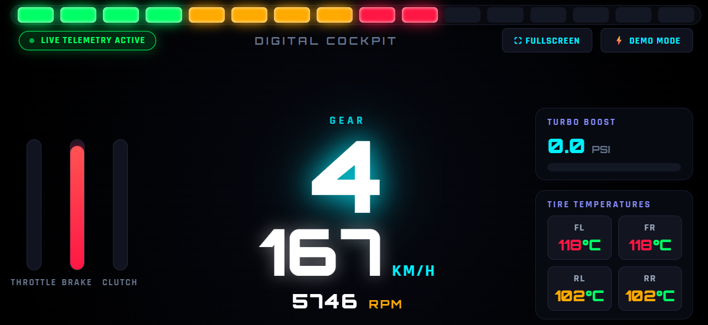

# 🏎️ Forza Horizon 6 · Wireless Mobile Telemetry Dashboard

> **Turn your smartphone or tablet into an ultra-responsive, real-time 60Hz wireless racing dashboard for Forza Horizon 6.**

A zero-install, browser-based digital cockpit that reads 60Hz UDP telemetry packets directly from **Forza Horizon 6** and streams them with sub-millisecond latency to your mobile screen via WebSockets.

---

<div align="center">
  
</div>

---

## 📱 Mobile-First Cockpit Features

- 🚥 **16-Stage F1 / GT3 LED Shift Lights:** Color-coded shift LEDs (Green ➔ Amber ➔ Red ➔ Blue) with high-intensity strobe flashing at the redline.
- 📳 **Haptic Shift Vibration:** Your phone vibrates the moment you hit the optimal gear shift RPM.
- 💡 **Automatic Screen Wake Lock:** Keeps your phone/tablet screen ON continuously during races (no screen sleep/dimming).
- ⛶ **One-Tap Fullscreen:** Double-tap or press fullscreen to hide browser bars and get a clean sim-rig display.
- ⚡ **Precision Real-Time Telemetry:**
  - Digital Speedometer (km/h)
  - Giant Gear Display (R / N / 1–6+)
  - Engine Tachometer (RPM & Limiter)
  - Responsive Throttle, Brake, and Clutch pressure gauges
  - Turbo Boost gauge (PSI)
  - **4-Wheel Independent Tire Heatmap** (°C with Cold/Optimal/Hot color indicators)
- 🧪 **Built-in 60Hz Simulator:** Test and demonstrate the full dashboard on your phone without even launching the game!

---

## 📖 Step-by-Step Setup Guide (Super Easy / 3 Steps)

Follow these simple steps to get your mobile dashboard running in under 2 minutes:

### 🛠️ Step 1: Start the Dashboard on your PC
Make sure you have [Node.js](https://nodejs.org/) installed, open your terminal inside the project folder and run:
```bash
npm install
npm start
```

---

### 📱 Step 2: Setup on your Phone (No App Installation Required!)
1. **Connect to Wi-Fi:** Make sure your phone/tablet is connected to the **same Wi-Fi router / local network** as your PC.
2. **Scan the QR Code:** Open your phone's default camera app, point it at the QR code in your PC terminal, and tap the notification link *(or manually type `http://<YOUR_PC_IP>:8080` in Chrome/Safari)*.
3. **Rotate to Landscape:** Turn your phone horizontally (Landscape orientation) for the best cockpit view.
4. **Enter Fullscreen Mode:** Tap the **"⛶ FULLSCREEN"** button in the top-right corner (or double-tap anywhere on the screen) to remove browser address bars.
5. **Mount & Race:** Place your phone on a steering wheel phone mount, desk stand, or under your monitor. 
   - 💡 *Screen Wake Lock automatically keeps your display awake throughout the race.*
   - 📳 *Your phone will automatically vibrate to alert you when to shift gears!*

---

### 🎮 Step 3: Configure Forza Horizon 6 In-Game
1. Launch **Forza Horizon 6** on your PC or Xbox.
2. Go to: **Settings ➔ HUD and Gameplay**.
3. Scroll down to the very bottom:
   - **Data Out:** Set to `ON`
   - **Data Out IP Address:** Enter your PC's IP address shown in the terminal *(e.g. `192.168.1.xxx` or `127.0.0.1` if playing on the same PC)*
   - **Data Out IP Port:** `5300`
4. Save settings and start driving — **your phone will instantly light up and display real-time telemetry!** 🏎️💨

---

## 🧪 Testing Without the Game (Demo Simulator)

Want to test your phone screen without starting Forza?
Simply run the standalone 60Hz vehicle physics simulator on your PC:

```bash
npm run sim
```
Or simply tap the **"⚡ DEMO MODE"** button directly on your phone screen!

---

## 🛠️ Tech Stack & Architecture

- **Backend:** Node.js, `dgram` (UDP 60Hz Socket Listener), `ws` (WebSocket Server), `qrcode`
- **Frontend / Mobile Client:** Vanilla HTML5, CSS3 Grid/Flexbox, JavaScript (WebSockets, Screen Wake Lock API, Web Vibration API)
- **Telemetry Protocol:** 324-byte Forza UDP Data Out (Dash Format)

---

## 📄 License
Distributed under the MIT License. Built for Forza Horizon 6 racers & sim-rig enthusiasts.
